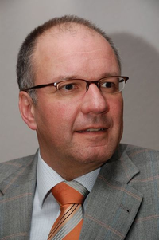

# Welcome!

My name is Frank Kesel. I am a professor at the University of Applied Sciences in Pforzheim, which is not far from Stuttgart, Germany.
I am teaching and researching in the fields of digital hardware design with FGPAs and programming of Embedded Systems based on microcontrollers or single-board computers.

---

If you want to contact me, please send me an email to: frank.kesel@hs-pforzheim.de
